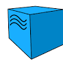
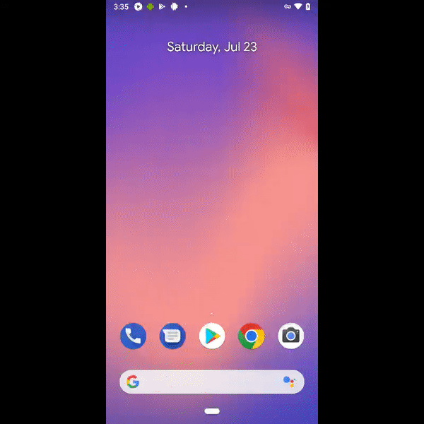

# mobile-tests-example
# Project with mobile tests for wikipedia app.


## :page_with_curl: Scope:

- <a href="#computer-сode_stack">Technology and tools</a>
- <a href="#clipboard-Test-cases">Test-cases</a>
- <a href="#Jenkins-job">Jenkins job</a>
- <a href="#keyboard-launch-from-terminal">Launch from terminal</a>
- <a href="#bar_chart-Test-results-report">Test results report</a>
- <a href="#robot-Telegram">Telegram Bot Notifications</a>
- <a href="#film_projector-Example-video-of-test-run-in-Selenoid">Example video of test-run in Selenoid</a>

## :computer: Technology and tools
<p align="left"> 





</p>

## :clipboard: Test-cases
First Onboarding page checking
Checking Info about Onboardingsettings
Checking 3rd Onboarding page Offer to join
Checking 4th Onboarding page Get started

##  Jenkins job
 https://jenkins.autotests.cloud/job/HW_22MobileTests/


## :keyboard: Launch from terminal
Local launch:
```
gradle clean test -Dhost=emulator
```

Remote launch:
```
clean
test
-Dhost=emulator

clean
test
-Dhost=device

clean
test
-Dhost=browserStack

##  Test results report [Allure Report]()
### :pushpin: Overview page Allure-report


### :pushpin: Behavior page


### :pushpin: Graph Page

!


##  Telegram Bot Notifications

> When build is completed,  the message with test result is sent by bot created in <code>Telegram</code> automatically 


##  Example video from BrowserStack

Every test contains last screenshots, page source, browser console logs, video in attachments. One of this viedo can see below.
<p align="center">

</p>
